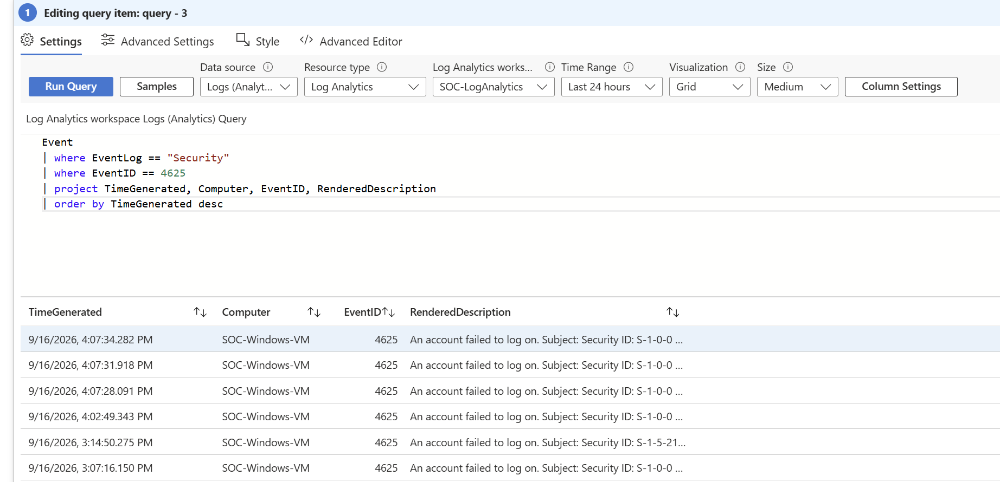
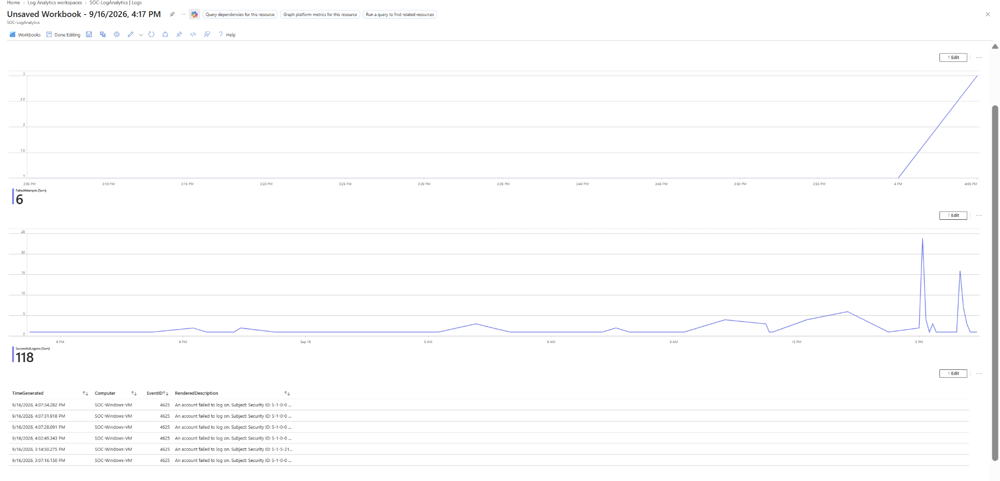

# Azure Windows Security Event Monitoring & Failed Logon Detection

## Project Overview

This project demonstrates a hands-on Windows security monitoring lab built in Microsoft Azure. I configured a Windows 11 virtual machine to send Windows Security events to Azure Log Analytics using Azure Monitor Agent (AMA) and a Data Collection Rule (DCR).

Using Kusto Query Language (KQL), I investigated successful and failed authentication events, created a threshold-based failed logon detection, and built an Azure Workbook to visualize authentication activity.

## Architecture

```text
Windows 11 Azure VM
        ↓
Azure Monitor Agent (AMA)
        ↓
Data Collection Rule (DCR)
        ↓
Log Analytics Workspace
        ↓
KQL Detection & Investigation
        ↓
Azure Workbook Dashboard
```

## Technologies Used

- Microsoft Azure
- Windows 11 Virtual Machine
- Azure Monitor Agent (AMA)
- Data Collection Rules (DCR)
- Azure Log Analytics
- Kusto Query Language (KQL)
- Windows Security Event Logs
- Azure Workbooks

## Lab Objectives

- Collect Windows Security events from an Azure VM
- Ingest security logs into Azure Log Analytics
- Investigate successful and failed authentication attempts
- Analyze Windows Event IDs 4624 and 4625
- Detect multiple failed logons within a short time window
- Build a SOC-style monitoring dashboard using Azure Workbooks

## Windows Events Investigated

### Event ID 4624 — Successful Logon

Event ID 4624 records successful Windows authentication activity. I used KQL to analyze successful logons and visualize authentication activity over time.

### Event ID 4625 — Failed Logon

Event ID 4625 records failed Windows authentication attempts.

During testing, the collected event data included information such as:

- Account name
- Failure reason
- Logon type
- Workstation name
- Authentication package

The lab successfully captured multiple failed authentication attempts for investigation.

## Failed Logon Detection

I created a KQL detection to identify a computer generating **3 or more failed logon attempts within a 5-minute window**.

```kusto
Event
| where EventLog == "Security"
| where EventID == 4625
| summarize FailedAttempts=count() by Computer, bin(TimeGenerated, 5m)
| where FailedAttempts >= 3
| order by TimeGenerated desc
```

During testing, the detection successfully identified **3 failed authentication attempts within a 5-minute period**.

## SOC Workbook

I created an Azure Workbook containing:

- Failed logon threshold detection
- Failed authentication activity over time
- Successful authentication activity over time
- Recent failed logon events for investigation

This provides a central dashboard for reviewing Windows authentication activity and investigating suspicious logon behavior.

### Failed Logon Investigation - Event ID 4625

The following query results show the failed Windows authentication events collected from the monitored Azure VM.



### Azure SOC Workbook Dashboard

The completed workbook visualizes failed and successful authentication activity and provides recent failed-logon events for investigation.



## Skills Demonstrated

- Windows Security Event monitoring
- Authentication log analysis
- KQL querying
- Security event investigation
- Threshold-based detection logic
- Azure Monitor
- Azure Log Analytics
- Azure Workbooks
- SOC-style security monitoring

## Key Takeaway

This project demonstrates an end-to-end security monitoring workflow: generating authentication activity, collecting Windows security telemetry, investigating events with KQL, creating detection logic, and visualizing the results in an analyst-friendly Azure Workbook.

